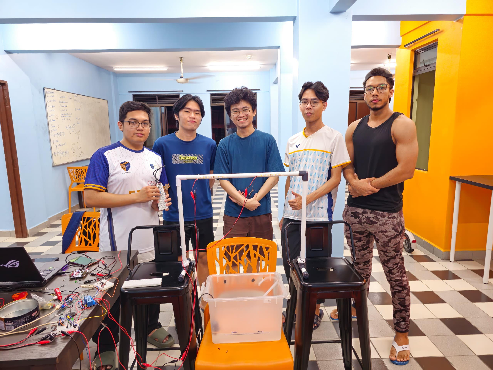
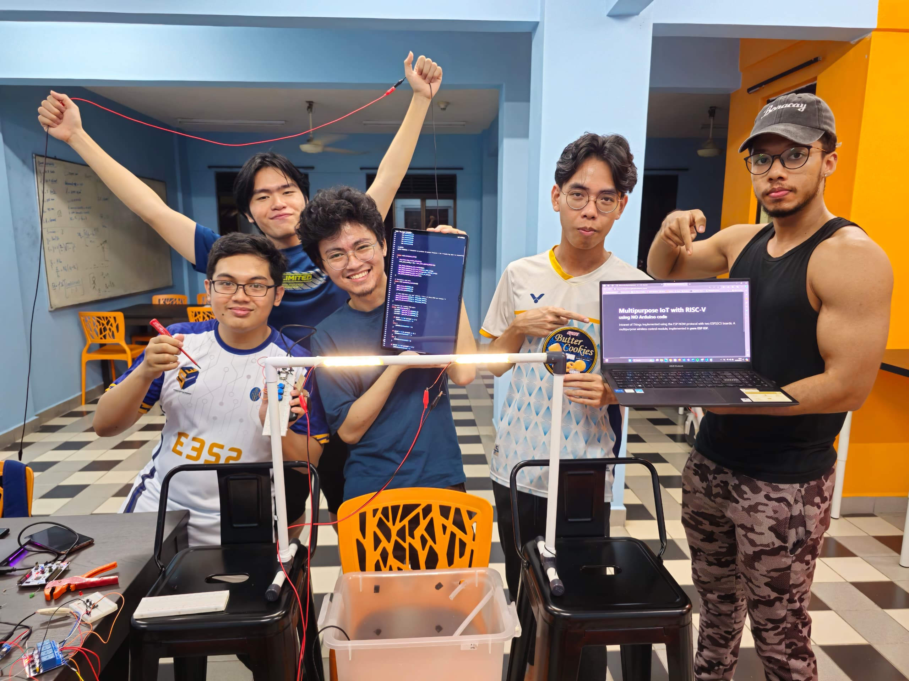

+++
title = 'About the team'
summary = "More information on each team member"
draft = false
weight = 1
+++

## Team members

At the time of taking this course, we are second year third semester Electrical and Electronics Engineering students in Universiti Teknologi PETRONAS.

| Volintine Ander  | Zechariah Hwong | Eddry Haqimy |
|:-:|:-:|:-:|
| 21001524 | 21001586 | 21001460 |
|  |  |  |

| Aziz Abdul Bagas | Kensley Kudang Kennedy |
|:-:|:-:|
| 21000360 | 21001068 |
|  |  |

## Task allocation
> - **Volintine Ander** - Writing ESP IDF code, website setup, Git repository setup
> - **Zechariah Hwong** - Transmitter coding, research
> - **Eddry Haqimy** - Receiver coding, video editing
> - **Aziz Abdul Bagas** - Web report writing, video direction
> - **Kensley Kudang Kennedy** - Electrical wiring, web report writing

