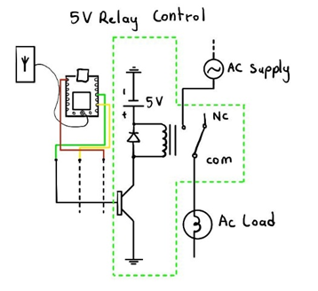

+++
title = 'Project Outomes & Accomplishments'
summary = "See our end product in action, conclusion, and future recommendations"
draft = false
weight = 5
+++

## End product
> There are no words that best describe our promising project, so let us demonstrate our end product in action in the following video:

(Youtube video here)

## Applications
>The Module serves as a very flexible attachment to any control systems that require switching. A receiver and transmitter are only required to establish the Intranet system. An example of application of the module would be in a relay circuit as the switch relay as shown below. The receiver would interact with the switch to enable the power of any high-powered system without being connected to the board and potentially frying it. 





> Our Multipurpose IoT Automation with RISC-V project can be implemented in endless scenarios, examples of application in the industry for this relay circuit would be::
> - Public Transport - Sexual harassment alarm, vehicle access, etc. 
> - Home Automation - Light control, security systems, etc.
> - Industrial Application - Machine control, process monitoring, etc.
> - Health Care - Patient room control, emergency systems, etc.
> - Agriculture - Irrigation control, greenhouse automation, etc.

## Conclusion
Our module is a proof-of-concept implementation of cloudless IoT technology. This paves the road towards *Intra*net of Things as opposed to *Inter*net of Things. Our system operates independently of third-party vendors (such as AWS, Azure, Clouflare, etc.), ensuring complete vendor independence. The benefits of this approach make it an attractive option for organizations looking for secure IoT solutions, unlike the mainstream approach.

> - The primary advantage of our approach is **full data sovereignty**, allowing users to maintain full control over information and access.
> 
> - Our module is **fully air-gapped**, as no data is exchanged with external servers. This decreases the attack surface for malicious parties to exploit.
> 
> - Businesses can achieve a higher degree of **security** and **privacy** while retaining complete ownership of their data.

## Recommendations